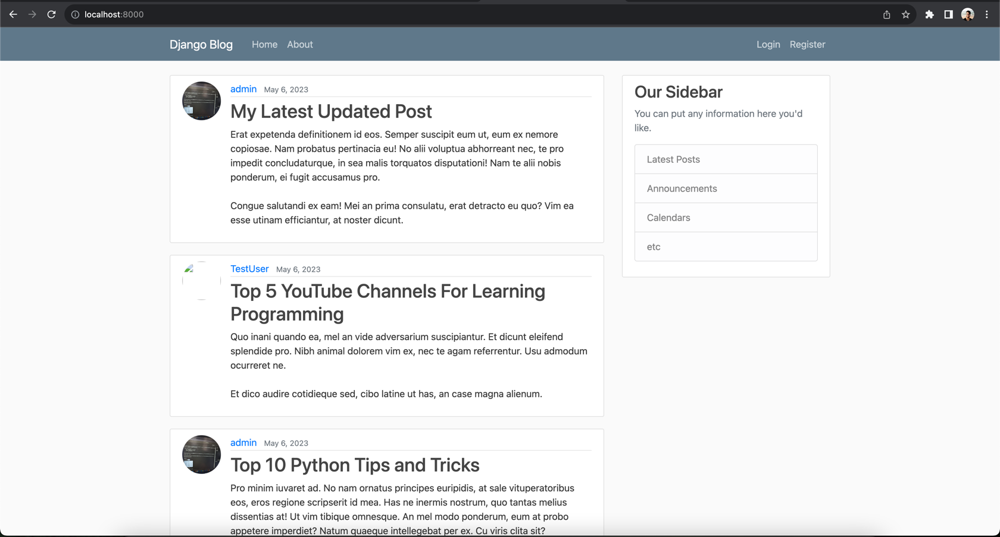
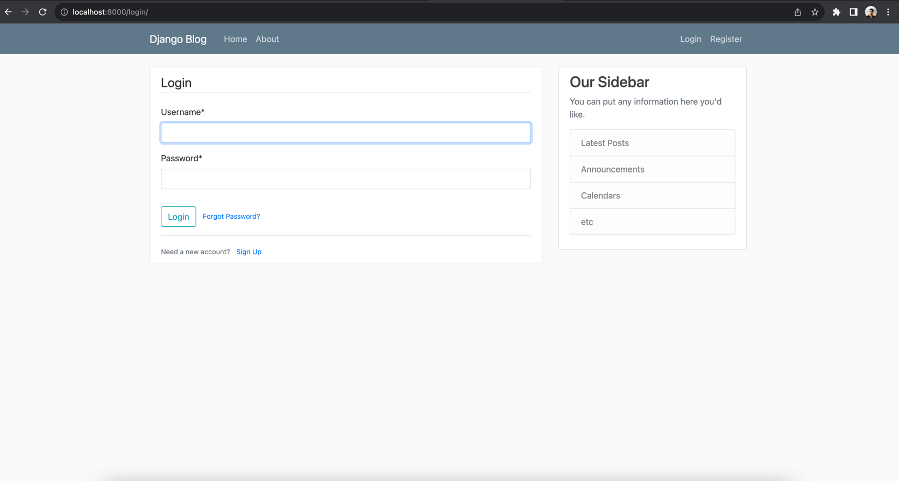
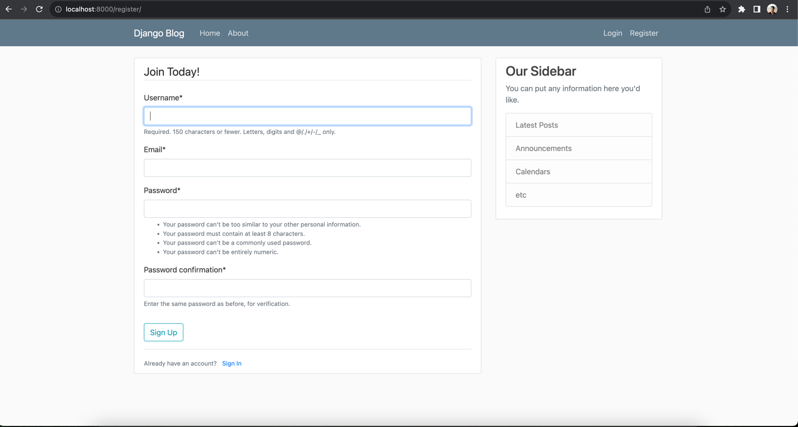

# Blog App - Django Python Practice App

Below are some helpful commands that were used in building this application:

- brew install python@3.11
- python3 -m pip install Django
- python3 -m pip install -e django/
- python3 django-admin  
- python3 --version

- mkdir code
- python3 -m venv .venv  
- source .venv/bin/activate   
- python -m pip install --upgrade pip
- python3 -m pip install django~=4.2.0
- python3 -m pip install black
- code . 

- django-admin startproject django_project .
- python manage.py runserver 
- deactivate
- django-admin help 

- python manage.py startapp blog
- python manage.py migrate
- python manage.py createsuperuser
- python manage.py makemigrations
- python manage.py sqlmigrate blog 0001
- python manage.py shell
- python manage.py startapp users

- pip install django-crispy-forms
- pip install crispy-bootstrap4
- python -m pip install Pillow

- pip freeze > requirements.txt

#### App gets deployed here: http://127.0.0.1:8000

## References

- https://www.youtube.com/watch?v=UmljXZIypDc&list=PL-osiE80TeTtoQCKZ03TU5fNfx2UY6U4p
- https://djangoforbeginners.com/initial-setup/